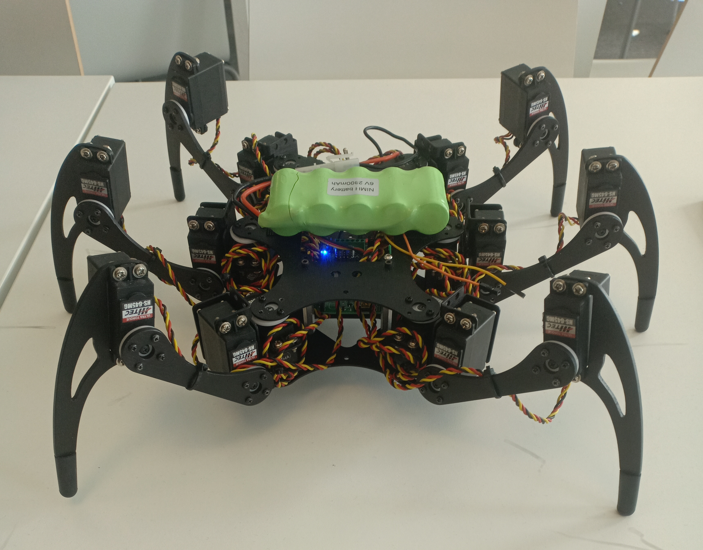

# Hexapod

[](https://www.youtube.com/watch?v=htWsSTcH6iU&feature=youtu.be "Youtube demo")
***You can click this image for a demo video***

## Quick start

The Hexapod can be controlled using a tkinter GUI or with a more classic prompt.\
Both work the same way and are easy to use.

1. Plug in the battery
2. Turn it on
3. Connect to the Hexapod wifi (no password required) (or plug the mini usb cable)
4. Launch Client/main.py
5. Just use the action buttons (sit, stand, walk...)

## About the gui


There are two mains usages for the gui
- Call predefined function (at the bottom). Those are hardcoded movements like sit, stand etc ...

- Test a specific action (most of the others widgets)

#### Actions panel

- If you use ```forward```, ```backward```, ```rotate_right``` or ```rotate_left``` you have to stop the movement using ```stop```

- You ***must*** be in position ```stand1``` if you want to call ```dab```, ```forward```, ```backward```, ```rotate_right```, ```rotate_left``` or  ```wave```

#### Engine panel

Allows you to choose with which engine you want to work

- ```Left``` and ```Right``` select the side of the engine you want to move
- ```Front```, ```Middle``` and ```Rear``` select the position of the engine
- ```Hori```, ```Verti``` and ```Knee``` select which engine you want to move

- ```All types``` checkbox allow you to move all engine of a specific type at once (types are ```knee``` ```verti``` and ```hori```)

- ```Live``` is quite cool, it allows you to directly send the command when the ```Angle``` slidebar is changed

***Combining ```Live``` and ```All types``` is useful !***

#### Angle panel

Allows you to change the angle of an engine

- The slidebar can be moved to change the angle of an engine
- The little textbox on the left is here if you need a value that is not on the slidebar
- The ```Angle Equivalent``` label on the right shows you the exact value that will be send to the engine (mainly for debugging)

#### Speed panel

Allows you to change the speed of the movements

- The slidebar can be moved to change the speed
- The little textbox on the left is here if you need a value that is not on the slidebar
- the ```Action speed``` checkbox on the right if you want to apply the selected speed to the predefined actions. (The default speed for actions is 700)

- ```send``` button send the command

#### History panel

A little history of the command you sent

- After a command is sent, it will be shown in the history
- ```Play``` button play a selected command
- ```Play all``` button play all command of the history in the order they arrived
- ```Edit``` allows you to edit a selected command
- ```delete``` allows you to delete a selected command
- ```clear``` clears history


#### Min/Max panel

Change the angle min/max values of an engine

##### !!! Be carefull with that, only use it if you know what you're doing !!!

- ```Min``` value is controlled with the left slidebar
- ```Max``` value is controlled with the right slidebar
- ```Save``` Button save the values in ***Client/constants.json***

***This panel is mainly used for debugging and engine calibration***

## Pinout

Connect :

-  `VS2+` from the Hexapod to `VIN` on the ESP-32.
-  `VS2-` from the Hexapod to `GND` on the ESP-32.

-  `TX` from the Hexapod to `D2` on the ESP-32.
- `RX` from the Hexapod to `D15` on the ESP-32.
-  `G` from the Hexapod to `GND` on the ESP-32.


#### Flash and power the ESP-32

- Flash the arduino code from `./Arduino_code` to the ESP-32.
- The file to flash is ./Arduino_code/hexapod.ino

# Notes

For any assistance, feel free to ask to:

- `lorenzo.rosmarino@epitech.eu`

- `yohann.assouline@epitech.eu`


- ## /!\ Don't forget to charge the batteries

# Links

The official webpage : http://www.lynxmotion.com/c-117-phoenix.aspx
